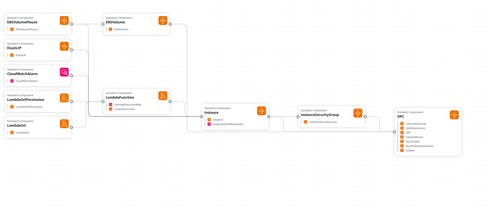

# Factorio Headless Server Template

This template creates all the AWS infrastructure to run a dedicated server for the popular game Factorio. It creates the following resourcess:

- VPC with a CIDR range chosen by the user, defaults to `10.11.0.0/24`
- A Subnet within that VPC with an auto selected `/27` CIDR range and inside the first AZ.
- An Internet Gateway attached to the VPC.
- A Route Table attached to the subnet that routes all traffic to the IGW.
- A Security Group that allows:
    - SSH Traffic IN for all IPv4.
    - UDP Traffic IN for all IPv4 on port 34197 (the port used by Factorio).
    - TCP Traffic OUT for all IPv4 for system updates.
    - ICMP Traffic OUT for pings and general debugging.
- An EBS volume to persistently store savegames and the server install.
- An EC2 instance that uses the previously defined EBS volume and Security Group with user data execution that does the following:
    - Mounts the EBS volume and modifies `/etc/fstab` so it is automatically mounted on each boot
    - Downloads and unzips the specified Factorio server version.
    - Creates a new map.
    - Configures the server name, password, and general settings.
    - Creates a bash script on `/var/lib/cloud/scripts/per-boot/` so it will run the server on each boot
    - Runs the server
- An Elastic IP attached to the EC2 ENI so that the server maintains its IP across restarts.
- A CloudWatch alarm that watches the `CPUUtilization` of the EC2 Instance and stops it if it is idle (i.e. there are no players connected to the server) for 30 minutes.
- A Lambda function that can start the EC2 instance on invocation.
- A Lambda URL that allows any user to start the server via a POST request to its endpoint.

It also outputs the following values:
- The server IP
- The server port
- The server password
- The `curl` command to remotely start the server

The diagram stack can be found below:
